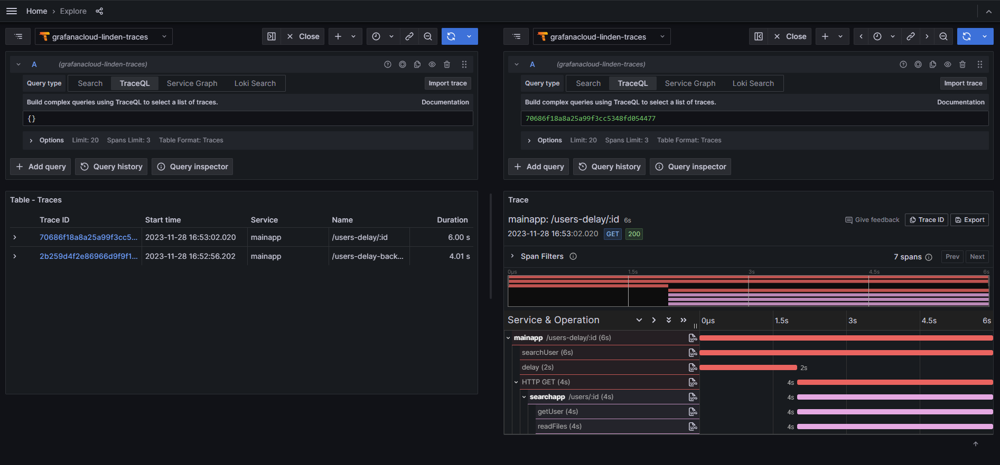

# Go microservices using Echo for demonstrating distributed tracing with OpenTelemetry + Grafana Tempo

## Prerequites:

1. Grafana Cloud account (Free): https://grafana.com/products/cloud/
2. Create `OTEL_EXPORTER_OTLP_HEADERS` environment variable following the docs in (https://grafana.com/docs/grafana-cloud/send-data/otlp/send-data-otlp/#push-directly-from-applications-using-the-opentelemetry-sdks)
3. Run "docker compose up"

## Access the following endpoints to generate traces

- http://localhost:8080/users-delay-background/123
- http://localhost:8080/users-delay/123
- http://localhost:8081/users/123

## The traces will be available at your grafana cloud explore tab, under the tempo datasource

Search with TraceQL using the following query: {}

